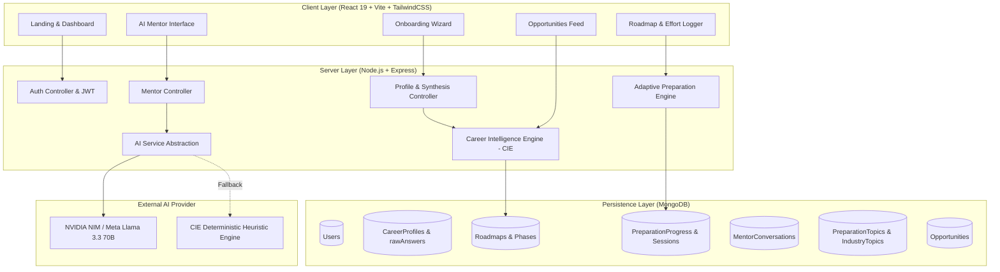

<div align="center">

# 🎓 BeyondCGPA
### Adaptive Career Intelligence & Preparation Engine for University Engineers

[](https://react.dev/)
[](https://nodejs.org/)
[](https://expressjs.com/)
[](https://www.mongodb.com/)
[](https://build.nvidia.com/)
[](https://tailwindcss.com/)

**The system that adapts to the student — not the student to a rigid, punitive plan.**

[Live Demo](#-live-demo--preview) • [Key Features](#-core-innovations--features) • [System Architecture](#-technical-architecture) • [Project Snapshots](#-project-snapshots) • [Quickstart for Judges](#-quickstart-guide-for-judges)

</div>

---

## 💡 The Problem: Why University Career Prep is Broken

Every year, millions of computer science and engineering undergraduates navigate a chaotic, stressful placement preparation landscape:

1. **The "Streak Guilt" & Burnout Trap**: Traditional platforms (LeetCode, Duolingo-style apps) push daily streaks. Miss one day during semester exams or personal emergencies, your streak resets to zero, destroying morale.
2. **One-Size-Fits-All Rigid Roadmaps**: Static roadmaps force students through 400+ problems in lockstep, ignoring prior knowledge, available weekly study hours, or domain specialization (Frontend vs Backend vs AI/ML).
3. **Superficial "Chatbot" Mentors**: Generic AI bots have zero visibility into what topic the student is actually studying, their current pace, or recent confidence logs, spewing generic boilerplate advice.
4. **Disconnected Job Portals**: Students apply blindly to hundreds of postings without knowing if their current skills actually match the role requirements.

---

## 🚀 The Solution: BeyondCGPA

**BeyondCGPA** is an autonomous Career Intelligence Engine (CIE) and engineering companion built from the ground up for university engineers:

- **Workload Units > Calendar Streaks**: Preparation is budgeted in effort units. If you miss days during midterms, there is **zero penalty**. Your remaining effort units remain safely preserved and redistributed forward.
- **Career Intelligence Engine (CIE)**: A deterministic orchestration layer that calibrates baseline proficiency, sequences prerequisite-aware roadmaps, and computes realistic **Readiness Horizons** without promising fake placement dates.
- **Root-Level Context-Aware AI Mentor**: Fed with live MongoDB student telemetry (onboarding answers, roadmap units, Today's Focus, velocity multiplier, and recent effort logs) on every single request.
- **Industry Awareness Calendar**: Daily architecture deep dives (Kafka, Redis, WebSockets, Docker, Kubernetes) built for technology history, not streak anxiety.
- **Skill-Scored Opportunities Pipeline**: Matches active internships and roles against the student's *verified* completed roadmap units, highlighting exact strengths and skill gaps.

---

## 📸 Project Snapshots

> *Screenshots are located in [`project_snapshots/`](./project_snapshots/). Replace the dummy files with your high-resolution captures.*

### 1. Student Command Center Dashboard
*Today's Focus, Live Readiness Horizon (~X months), Pacing Health, Velocity multiplier, and quick AI mentor access.*

<div align="center">
  
</div>

---

### 2. Context-Aware AI Career Mentor
*Interactive mentor with live student DB telemetry (career track, weekly hours, remaining units) that reasons about workload & pacing.*

<div align="center">
  
</div>

---

### 3. Adaptive Preparation Roadmap
*Sequenced curriculum phases (DSA, Development, System Design, Core CS) with non-punitive effort units allocation.*

<div align="center">
  
</div>

---

### 4. Verified Opportunities Pipeline
*Internship and job postings dynamically scored against the student's verified curriculum mastery with exact skill gap analysis.*

<div align="center">
  
</div>

---

## ⚡ Core Innovations & Features

### 1. Workload-Based Pacing (Zero Streak Penalty)
- Traditional streaks treat humans like machines. BeyondCGPA measures progress in **allocated effort units** (e.g. 3 units for Two Pointers, 4 units for REST API Architecture).
- Missed a week for semester finals? The system computes **zero penalty**. Pacing health gracefully reallocates remaining units across the readiness horizon.

### 2. Career Intelligence Engine (CIE)
- **Baseline Calibration**: Onboarding extracts free-text background, preferred pace (`Balanced`, `Accelerated`, `DeepFoundation`), target domain (`Frontend`, `Backend`, `Fullstack`, `AI/ML`, `Cloud/DevOps`, or `Undecided`), and calibrates a tailored curriculum.
- **Dynamic Rebalancing**: Logging effort with high confidence ($\ge 4/5$) scales velocity multiplier ($>1.0\times$) and accelerates subsequent units. Struggling with low confidence ($\le 2/5$) dynamically inserts reinforcement review buffers without penalizing preparedness scores.
- **Realistic Horizon**: Computes estimated weeks until target readiness based on velocity and availability ($Target Weeks = \frac{\text{Remaining Hours}}{\text{Weekly Hours} \times \text{Velocity}}$).

### 3. Context-Aware AI Mentor (NVIDIA NIM / Llama 3.3 + CIE)
- **Persisted DB State Injection**: Queries authoritative database records on every request (`User`, `CareerProfile`, `Roadmap`, `PreparationProgress`, `Today's Focus`, and `rawAnswers`).
- **Pacing & Workload Coaching**: Understands nuances like *"It's too fast for me for learning new things"*, advising students on workload management rather than spouting canned greeting messages.
- **Strict CIE Guardrails**: CIE is the authoritative decision engine. The AI Mentor explains CIE state and provides engineering guidance, preventing hallucinated progress or unauthorized roadmap rewrites.
- **No Masked Errors**: Clear HTTP 503 provider alerts if external AI is unavailable, avoiding fake fallback deception.

### 4. Today's Focus vs. Today's Topic (Clear Separation of Concerns)
- **Today's Focus**: The single highest-leverage, unblocked preparation unit the student should work on *now*, complete with verified LeetCode/practical links and category interleaving.
- **Today's Topic**: Broad technology and systems awareness (e.g. how Discord scaled WebSockets or how Netflix utilizes Kafka) with a historical archive calendar that never punishes missed days.

---

## 🏗️ Technical Architecture



---

## 🛠️ Technology Stack

| Layer | Technologies Used | Rationale |
| :--- | :--- | :--- |
| **Frontend** | React 19, Vite, TailwindCSS v4, Lucide Icons, Canvas Confetti | Lightning-fast HMR, component isolation, premium micro-animations and typography. |
| **Backend** | Node.js, Express.js, REST API Architecture | Modular controllers, clean error middleware, decoupled domain services. |
| **Database** | MongoDB Atlas / Embedded `mongodb-memory-server` | Flexible schema for evolving career profiles, raw onboarding answers, and dynamic progress sessions. |
| **AI Engine** | NVIDIA NIM API (`meta/llama-3.3-70b-instruct`) & CIE Heuristic Engine | Dual-engine setup: cutting-edge LLM intelligence with deterministic offline heuristic fallback. |
| **Authentication** | Google OAuth 2.0 & Development Quick-Auth Bypass | Seamless one-click onboarding with direct local dev bypass for testing without API keys. |
| **Email Service** | Resend API / Console Dispatch | Transactional verification emails with automatic local preview fallback. |

---

## 🚀 Quickstart Guide for Judges

The application is engineered with **zero-friction local execution**. You do **not** need an external MongoDB cluster or paid API keys to test every single feature!

### Prerequisites
- Node.js $\ge$ 18.x
- npm $\ge$ 9.x

### 1. Clone the Repository
```bash
git clone https://github.com/MKinCODE/BeyondCGPA.git
cd BeyondCGPA
```

### 2. Backend Setup
```bash
cd server
npm install
cp .env.example .env
```
> **Note for Judges**: If `MONGODB_URI` is left blank in `.env`, the server **automatically boots an embedded local MongoDB instance (`mongodb-memory-server`)** and pre-seeds curriculum topics, industry topics, and opportunities!

Start the backend server:
```bash
npm run dev
# Express server starts on http://localhost:5000
```

### 3. Frontend Setup
Open a new terminal:
```bash
cd client
npm install
npm run dev
# Vite dev server runs on http://localhost:5173
```

### 4. Open in Browser & Test
1. Visit **`http://localhost:5173`**.
2. Click **"Get Started"** or **"Sign In"** $\rightarrow$ Use **"Instant Dev Sign In"** for one-click access without Google credentials.
3. Complete the Onboarding Wizard to calibrate your baseline roadmap.
4. Explore **Today's Focus**, log effort, check your **Readiness Horizon**, and chat with the **AI Mentor**!

---

## 🏆 Hackathon Evaluation Criteria Alignment

| Judging Criterion | How BeyondCGPA Delivers |
| :--- | :--- |
| **Innovation & Concept** | Replaces toxic, demotivating "streak anxiety" with **workload-based pacing** and adaptive readiness horizons tailored to university engineering life. |
| **Technical Complexity** | Built a custom **Career Intelligence Engine (CIE)** that performs multi-factor scoring, prerequisite graph traversal, dynamic velocity adaptation, and opportunity matching against verified skill units. |
| **AI Integration Polish** | Unlike static chatbots, the AI Mentor ingests live DB telemetry on every message, explains CIE decisions, coaches on pacing, and transparently handles external API states. |
| **UI/UX Excellence** | Curated palette (Warm Ivory `#F8F7F2`, Deep Navy `#0B172A`, Electric Teal `#12B8A6`), fluid layout transitions, responsive Bento cards, and accessibility. |
| **Reliability & Completeness** | End-to-end verified with automated audit test suites, embedded in-memory database fallbacks, and zero broken links. |

---

<div align="center">
  <sub>Built with ❤️ for University Engineers & Placement Aspirants by <b>BeyondCGPA Team</b>.</sub>
</div>
