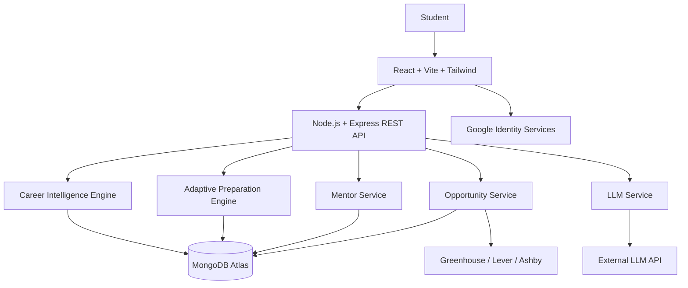
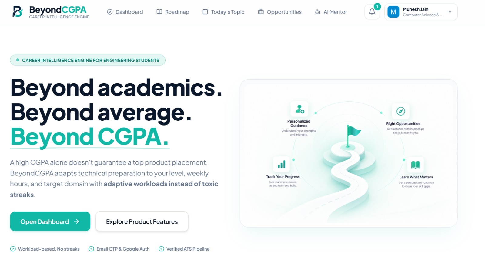
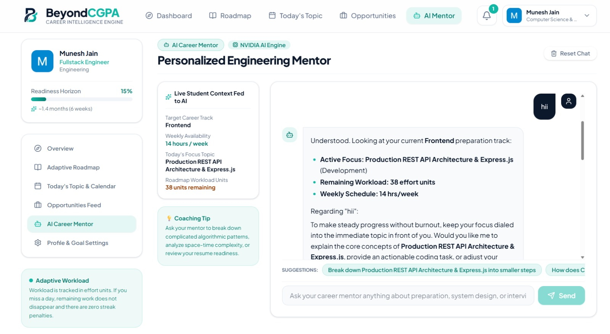
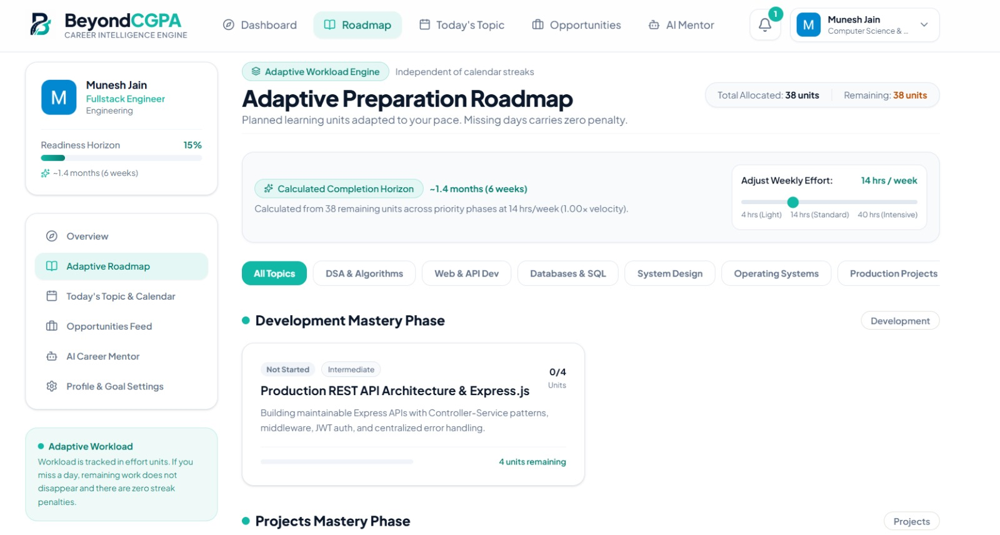
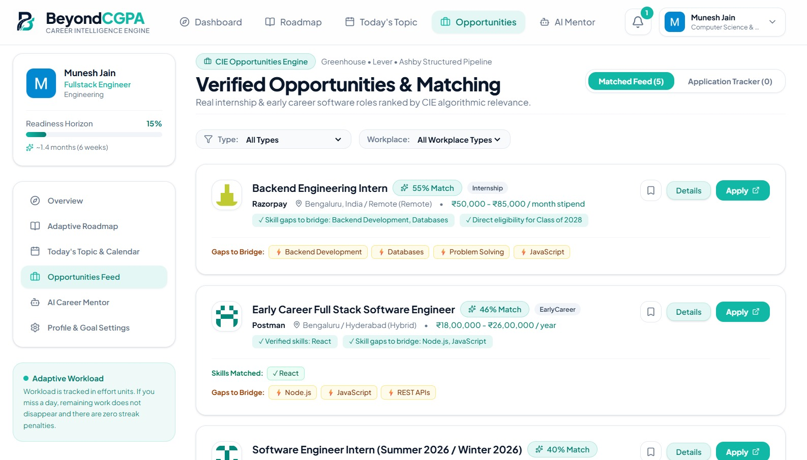

# BeyondCGPA

### Adaptive Career Intelligence & Preparation Engine for Engineering Students

> **Because placements demand more.**

BeyondCGPA helps engineering students understand **where they stand, what they should learn next, and which opportunities they can realistically target**.

It is built around an evolving student profile and a **Career Intelligence Engine (CIE)** that continuously adapts career direction, skill gaps, preparation workload, and next actions as the student makes progress.

---

## 🚀 Core Features

- **Career Intelligence Engine** — evaluates skills, career direction, gaps, priorities, prerequisites, and readiness.
- **Adaptive Preparation** — creates and continuously adjusts preparation across DSA, Development, DBMS, OS, OOP, System Design, Projects, and interview preparation.
- **Today's Focus** — gives one actionable task based on current skill gaps, progress, workload, and priorities.
- **AI Career Mentor** — provides contextual guidance using the student's current state and conversation history.
- **Dynamic Onboarding** — asks only the questions needed to understand the student's current state.
- **Internship & Job Matching** — matches students with relevant opportunities using structured public ATS data and profile-based matching.
- **Today's Topic** — separate industry-awareness feed for learning about technologies and market developments without affecting preparation progress.

---

## 🧠 How It Works

```text
Student Profile
      ↓
Career Intelligence Engine
      ↓
Career Direction + Skill Gaps
      ↓
Adaptive Preparation Roadmap
      ↓
Today's Focus
      ↓
Student Completes Work
      ↓
Effort + Confidence + Progress Evidence
      ↓
Student State Updates
      ↓
CIE Re-evaluates
      ↓
Next Action Changes
```

The key idea is a **closed feedback loop** rather than a static roadmap.

---

## 🏗️ Architecture



### Technology Stack

| Layer | Technology |
|---|---|
| Frontend | React, Vite, Tailwind CSS |
| Backend | Node.js, Express.js |
| Database | MongoDB Atlas, Mongoose |
| Authentication | Google Identity Services + JWT |
| AI | NVIDIA AI API / OpenAI-compatible LLM |
| Opportunities | Greenhouse, Lever & Ashby public ATS APIs |
| Email | Resend |
| Deployment | Vercel + Render |

### Architecture Principle

The LLM is used where language understanding is useful, such as **free-text extraction and contextual mentoring**.

The core career decisions are handled by the deterministic **CIE**, including prioritization, prerequisites, workload adaptation, mastery, and next-action selection.

---

## 🔐 Authentication

```text
Google Identity Services
        ↓
Google ID Token
        ↓
POST /api/auth/google
        ↓
Backend verifies token
        ↓
Application JWT
        ↓
Authenticated API requests
```

---

## 📸 Screenshots

### Dashboard


### AI Career Mentor


### Adaptive Roadmap


### Opportunity Matching


---

## 🌐 Live Demo

**Frontend:** https://beyondcgpa.vercel.app

**Backend API:** https://beyondcgpa.onrender.com

---

## 💡 Why BeyondCGPA?

Most career platforms show students **what exists**.

BeyondCGPA focuses on:

> **What should I do next, based on where I am right now?**

ChatGPT can provide career advice, but BeyondCGPA maintains an evolving student state, evaluates it against career requirements and opportunities, identifies measurable gaps, and continuously changes the student's next actions as new evidence appears.

---

## 🎯 Hackathon Alignment

BeyondCGPA addresses the core problem areas of:

- Skill extraction
- Career path matching
- Skill gap analysis
- Labour market intelligence
- Learning/resource mapping
- Progress tracking

---

## 👨‍💻 Author

**Mousam Kumawat**

GitHub: https://github.com/MKinCODE

---

> **BeyondCGPA — because placements demand more.**
